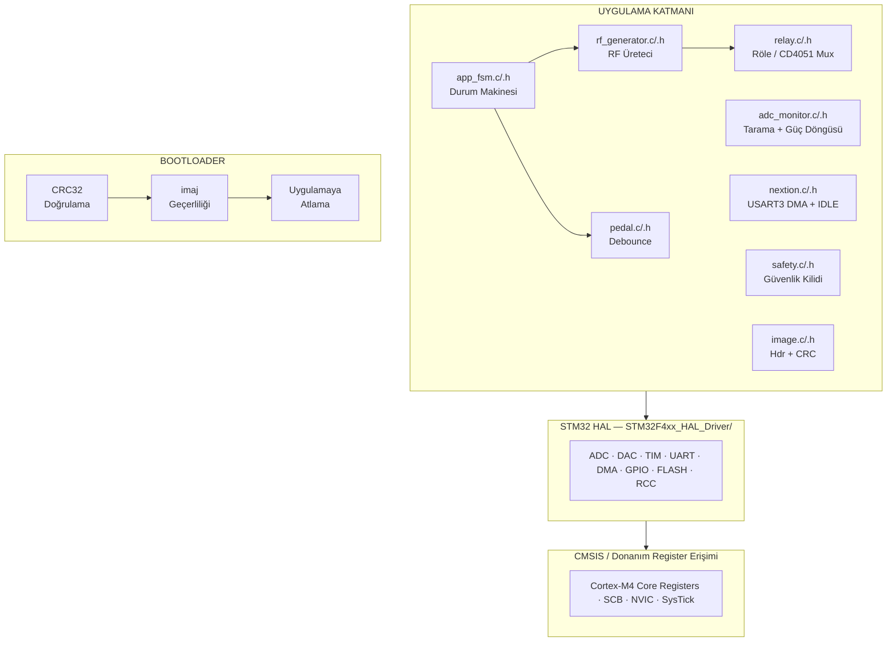

# Elektrokoter v0000

> **STM32F407VGTx** tabanlı, bootloader + uygulama mimarisine sahip tam donanımlı ürün yazılımı. Monopolar/bipolar kesim ve koagülasyon modlarını, RF güç kontrolünü ve NEXTION dokunmatik ekran entegrasyonunu kapsamaktadır.

---

## İçindekiler

1. [Proje Genel Bakışı](#1-proje-genel-bakışı)
2. [Donanım Özeti](#2-donanım-özeti)
3. [Yazılım Mimarisi](#3-yazılım-mimarisi)
4. [Depo Yapısı](#4-depo-yapısı)
5. [Bellek Haritası ve Bağlayıcı Betikleri](#5-bellek-haritası-ve-bağlayıcı-betikleri)
6. [Bootloader](#6-bootloader)
7. [Uygulama Katmanı](#7-uygulama-katmanı)
8. [Durum Makinesi (app\_fsm)](#8-durum-makinesi-app_fsm)
9. [RF Üreteci (rf\_generator)](#9-rf-üreteci-rf_generator)
10. [Röle ve Çoklayıcı Denetimi (relay)](#10-röle-ve-çoklayıcı-denetimi-relay)
11. [ADC İzleme ve Güç Kontrolü (adc\_monitor)](#11-adc-i̇zleme-ve-güç-kontrolü-adc_monitor)
12. [Pedal / El Anahtarı Sürücüsü (pedal)](#12-pedal--el-anahtarı-sürücüsü-pedal)
13. [Güvenlik Kilidi (safety)](#13-güvenlik-kilidi-safety)
14. [Nextion Ekran Sürücüsü (nextion)](#14-nextion-ekran-sürücüsü-nextion)
15. [Görüntü Başlığı ve CRC Doğrulaması](#15-görüntü-başlığı-ve-crc-doğrulaması)
16. [Flash Yardımcı Kütüphanesi (flash)](#16-flash-yardımcı-kütüphanesi-flash)
17. [Derleme Sistemi (CMake)](#17-derleme-sistemi-cmake)
18. [Geliştirme Ortamı Kurulumu](#18-geliştirme-ortamı-kurulumu)
19. [Derleme ve Yükleme](#19-derleme-ve-yükleme)
20. [Hata Ayıklama](#20-hata-ayıklama)
21. [Bağımlılıklar](#22-bağımlılıklar)

---

## 1. Proje Genel Bakışı

Bu depo, elektrocerrahi ünitesi (ESU) için geliştirilmiş, **STM32F407VGTx** mikrodenetleyicisi üzerinde çalışan tam kapsamlı bir gömülü yazılım çözümü içermektedir. Yazılım iki bağımsız ikili dosyadan oluşmaktadır:

| Bileşen | Adresi | Boyut | Açıklama |
|---|---|---|---|
| **Bootloader** | `0x08000000` | 16 KB | HAL bağımsız, CRC doğrulayıcı, görüntü doğrulayıcı |
| **Uygulama** | `0x08004200` | ~996 KB | Tüm ESU mantığı, HAL tabanlı |

### Temel Özellikler

- **Monopolar Modlar:** Kesim (Pure / Blend 1-3 / Polipektomi), Koagülasyon (Soft / Contact / Spray / Argon)
- **Bipolar Modlar:** Standart / Blend Kesim; Standart / AutoStart / Forced Koagülasyon
- **Kapalı Döngü RF Güç Kontrolü:** DAC çıkışı üzerinden orantısal denetleyici
- **Güvenlik Kiliitleri:** REM elektrodu denetimi, aşırı akım, aşırı sıcaklık
- **Nextion Dokunmatik Ekran:** USART3 DMA dairesel + IDLE kesme ile ikili protokol
- **Bootloader ile Güvenli Güncelleme:** CRC32 doğrulamalı görüntü başlığı

---

## 2. Donanım Özeti

### Mikrodenetleyici

| Özellik | Değer |
|---|---|
| Model | STM32F407VGTx |
| Paket | LQFP-100 |
| Çekirdek | ARM Cortex-M4F (FPU dahil) |
| Saat | 168 MHz (HSE 8 MHz + PLL: M=8, N=336, P=2) |
| Flash | 1 MB |
| SRAM | 128 KB + 64 KB CCM-RAM |

### Zamanlayıcı Tahsisi

| Zamanlayıcı | Kanal | Pin | Amaç | Frekans |
|---|---|---|---|---|
| TIM4 | CH1 | PD12 | CUT RF taşıyıcı | 350–500 kHz |
| TIM13 | CH1 | PA6 | COAG Soft / Bipolar taşıyıcı | 400–500 kHz |
| TIM14 | CH1 | PA7 | COAG Contact/Spray/Argon/Bip.Forced taşıyıcı | 400–727 kHz |
| TIM2 | CH1 | PA5 | Blend / Polipektomi zarfı | ~33 kHz |
| TIM3 | CH1 | PC6 | Polipektomi yavaş darbe | ~1,5 Hz |
| TIM9 | CH2 | PE6 | Ses buzer | 400–800 Hz |
| TIM5 | — | — | Polipektomi döngü tiki (100 Hz) | 100 Hz |

### Çevre Birimler

| Çevre Birim | Pin(ler) | Amaç |
|---|---|---|
| USART3 + DMA1 | PB10/PB11 | Nextion ekran (9600 baud, dairesel DMA + IDLE kesme) |
| USART1 | PA9/PA10 | Ürün yazılımı güncelleme (115200 baud) |
| ADC1 | PA0–PA3, PB0 | I₁, V, I₂, REM, TEMP — sürekli tarama |
| DAC CH1 | PA4 | RF amplifikatör kazanç kontrolü |
| CRC (donanım) | — | Bootloader CRC doğrulama |

### Dijital Çıkışlar

| Pin | Amaç |
|---|---|
| PE2 | CUT amplifikatör etkinleştirme (aktif-HIGH) |
| PE3 | COAG amplifikatör etkinleştirme (aktif-HIGH) |
| PE7 | Bipolar amplifikatör etkinleştirme (aktif-HIGH) |
| PB1 | Ses amplifikatörü etkinleştirme (aktif-HIGH) |
| PC13 | CUT aktif LED |
| PC2 | COAG aktif LED |
| PE8 | REM alarm LED |
| PC4 | Spray3 röle |
| PD11 | Monopolar röle |
| PC11 | Spray röle |
| PD3 | M2 röle |
| PD8 | Güç açma röle |
| PD9 | Fan etkinleştirme |
| PA8/PA11/PA12 | CD4051 çoklayıcı seçim (A/B/C) |

### Dijital Girişler

| Pin | Amaç |
|---|---|
| PC1 | Ayak pedalı CUT Mono1 (aktif-LOW) |
| PC8 | Ayak pedalı COAG Mono1 (aktif-LOW) |
| PE9 | Ayak pedalı CUT Mono2 (aktif-LOW) |
| PE10 | Ayak pedalı COAG Mono2 (aktif-LOW) |
| PB4 | El anahtarı CUT (aktif-LOW) |
| PB5 | El anahtarı COAG (aktif-LOW) |
| PB7 | REM OK sinyali (aktif-HIGH) |
| PB8 | Bipolar otomatik başlatma (aktif-LOW) |

---

## 3. Yazılım Mimarisi



### Modüller Arası İlişkiler

```
main.c
  └─▶ app_fsm_init()  ──▶ rfGen_init()
  │                   ──▶ adcMonitor_init()
  │                   ──▶ pedal_init()
  │                   ──▶ nextion_init()
  │
  └─▶ app_fsmProcess() [while(1)]
        ├── relay_update()
        ├── adcMonitor_scan()
        ├── pedal_update()
        ├── nextion_getPacket()
        ├── safetyCheck()
        └── Durum Makinesi Mantığı
              ├── rfGen_configure*()  ──▶ relay_apply()
              ├── rfGen_enable*()
              └── adcMonitor_powerLoop()

ISR'lar:
  TIM2_IRQHandler     ──▶ app_fsmBlendTick()  ──▶ rfGen_blendTickIsr()
  TIM5_IRQHandler     ──▶ app_fsmPolyTick()
  USART3_IRQHandler   ──▶ app_fsmIdleIsr()    ──▶ nextion_cbIdleIsr()
  DMA1_Stream1_IRQn   ──▶ HAL_DMA_IRQHandler()
```

---

## 4. Depo Yapısı

```
esu_stm32f407/
│
├── CMakeLists.txt              # Ana derleme tanımı
├── CMakePresets.json           # Debug / Release / hedef ön ayarları
├── requirements.txt            # Python bağımlılıkları
├── nextion10inchfull11.ioc     # STM32CubeMX proje dosyası
│
├── cmake/
│   └── gcc-arm-none-eabi.cmake # Toolchain tanımı
│
├── linker/
│   ├── bootloader.ld           # Bootloader bağlayıcı betiği
│   └── app.ld                  # Uygulama bağlayıcı betiği (header + app)
│
├── bootloader/
│   ├── inc/main.h
│   ├── startup/startup_stm32f407vgtx.s
│   └── src/
│       ├── bootloader.c        # Başlatma, CRC, atlama
│       └── system_stm32f4xx.c  # SystemInit (HSI)
│
├── core/
│   ├── inc/
│   │   ├── main.h
│   │   ├── stm32f4xx_it.h
│   │   ├── stm32f4xx_hal_conf.h
│   │   ├── app_defs.h          # Tüm enum'lar, struct'lar, paket tanımı
│   │   ├── app_fsm.h           # Durum makinesi genel API
│   │   ├── rf_generator.h      # Zamanlayıcı grubu + RF mod API
│   │   ├── relay.h             # Röle + CD4051 çoklayıcı soyutlama
│   │   ├── adc_monitor.h       # ADC tarama + güç döngüsü + güvenlik
│   │   ├── pedal.h             # Ayak/el pedalı debounce
│   │   ├── safety.h            # REM kilidi
│   │   └── nextion.h           # USART3 DMA+IDLE Nextion sürücüsü
│   │
│   ├── startup/startup_stm32f407vgtx.s
│   └── src/
│       ├── main.c              # HAL başlatma, MX_*, app_fsm_init, döngü
│       ├── system_stm32f4xx.c  # SystemInit (168 MHz HSE PLL)
│       ├── stm32f4xx_it.c      # ISR dağıtımı
│       ├── stm32f4xx_hal_msp.c # HAL MSP başlatma / sonlandırma
│       ├── syscalls.c          # Sistem çağrıları
│       ├── sysmem.c            # Heap yöneticisi
│       ├── image_header.c      # .image_hdr bölümüne yerleştirilmiş başlık
│       ├── app_fsm.c           # Durum makinesi uygulaması
│       ├── rf_generator.c      # Zamanlayıcı yeniden yapılandırma
│       ├── relay.c             # Röle/çoklayıcı arama tablosu
│       ├── adc_monitor.c       # Tarama + orantısal güç döngüsü
│       ├── pedal.c             # Debounce uygulaması
│       ├── safety.c            # adc_monitor'e delege eder
│       └── nextion.c           # Halka arabelleği DMA takibi, paket doğrulama
│
├── common/
│   ├── inc/
│   │   ├── image.h             # image_hdr_t tanımı, magic sayı, adresler
│   │   ├── crc.h               # CRC doğrulama API
│   │   └── flash.h             # Flash yazma/silme yardımcıları
│   └── src/
│       ├── image.c             # image_isValid()
│       ├── crc.c               # Donanım CRC
│       └── flash.c             # Sektör silme/yazma/okuma
│
├── scripts/
│   ├── patch_image_header.py   # Derleme sonrası CRC + boyut bilgisi ekleme
│   ├── merge_bootloader.py     # BL + App → tek firmware.bin
│   └── tools/
│       ├── memap.py            # GCC map dosyası bellek analizi
│       ├── gdbserver-wrapper.sh
│       └── find_stm32cubeclt.py
│
├── Drivers/
│   ├── CMSIS/                  # ARM CMSIS + ST cihaz başlıkları
│   └── STM32F4xx_HAL_Driver/   # STM32F4xx HAL
│
└── .vscode/
    ├── launch.json             # Cortex-Debug yapılandırmaları
    └── tasks.json              # CMake derleme/yükleme görevleri
```

---

## 5. Bellek Haritası

### Fiziksel Flash Düzeni

```
0x08000000 ┌──────────────────────────────┐
           │    BOOTLOADER                │  16 KB
           │    (bootloader.ld)           │
0x08004000 ├──────────────────────────────┤
           │    IMAGE HEADER              │  0x200 (512 B)
           │    (image_hdr_t)             │
0x08004200 ├──────────────────────────────┤
           │    ISR VECTOR TABLE          │
           │    .text, .rodata            │
           │    .data (LMA)               │
           │    UYGULAMA                  │  ~996 KB
           │    (app.ld)                  │
0x08100000 └──────────────────────────────┘
```

### SRAM Düzeni (Uygulama)

```
0x20000000 ┌──────────────────────────────┐
           │    .data  (başlatılmış)      │
           │    .bss   (sıfırlı)          │
           │    heap   (_Min_Heap=0x200)  │
           │    stack  (_Min_Stack=0x400) │
0x20020000 └──────────────────────────────┘  128 KB

0x10000000 ┌──────────────────────────────┐
           │    .ccmram                   │  64 KB
           │    .shared_memory (NOLOAD)   │
0x10010000 └──────────────────────────────┘
```

### bootloader.ld

Bootloader bağlayıcı betiği yalnızca `0x08000000`'dan başlayan 16 KB Flash ve 128 KB + 64 KB CCM-RAM kullanır.

### app.ld

Uygulama bağlayıcı betiğinde iki ayrı Flash bölgesi tanımlanmıştır:

- `FLASH_HDR (rx)`: `0x08004000`, `0x200` boyut — `.image_hdr` bölümü bu alana yerleştirilir.
- `FLASH (rx)`: `0x08004200`'den itibaren geriye kalan Flash alanı.

Bağlayıcı ayrıca ürün yazılımı boyutunu hesaplamak için şu semboller ihraç eder: `__firmware_start`, `__firmware_end`, `__firmware_size`.

---

## 6. Bootloader

### Genel Bakış

### Bootloader Akışı

```
Reset
  │
  ▼
rcc_init()
  │  HSI'yı etkinleştir (16 MHz)
  │  CRC ve GPIOx saatlerini aç
  │
  ▼
gpio_init()
  │  GPIOx çıkışlarını yapılandır
  │
  ▼
bl_isImageValid()
  │  image_magic == IMAGE_MAGIC_APP (0xDEADC0DE) ?
  │  image_type  == IMAGE_TYPE_APP (1) ?
  │  data_size   > 0 ?
  │  (fw_addr + data_size) ≤ FLASH_END ?
  │  crc_calculate(fw_addr, data_size) == header->crc ?
  │
  ├─ GEÇERSİZ ──▶ Kırmızı LED yanıp söner (sonsuz döngü)
  │
  └─ GEÇERLİ
       │
       ▼
  deinit_system()
       │  NVIC, SysTick, RCC çevre birim saatleri sıfırla
       │  GPIOD girişe al
       │
       ▼
  boot_to_image()
       │  SCB->VTOR = APP_ADDR + IMAGE_HDR_SIZE
       │  __set_MSP(appMsp)
       │  pAppReset()  ──▶ Uygulamanın Reset_Handler'ı
```

### CRC Hesaplama

Bootloader, STM32 donanım CRC çevre birimini (32-bit, 0x04C11DB7 polinomu) kullanır. Hesaplama doğrudan Flash adresinden okuma yaparak gerçekleştirilir. 4'e bölünemeyen kalan baytlar son bir kelime olarak doldurulur.

```c
// Flash başlangıç adresi: APP_ADDR + IMAGE_HDR_SIZE
// CRC kapsamı: header->data_size bayt
uint32_t crc_calculate(uint32_t addr, uint32_t size);
```

### Görüntü Doğrulama Başarısızlık Durumu

Doğrulama başarısız olursa bootloader **asla** uygulamaya atlamaz. Sistemden çıkmanın tek yolu geçerli bir görüntü yükleyip donanım sıfırlaması yapmaktır.

### Uygulamaya Atlama (boot\_to\_image)

```c
// 1. Vektör tablosunu güncelle
SCB->VTOR = APP_ADDR + IMAGE_HDR_SIZE;   // 0x08004200

// 2. Main Stack Pointer ayarla
// Uygulamanın MSP değeri vektör tablosunun ilk kelimesidir
__set_MSP(*(uint32_t*)vectorAddr);

// 3. Reset Handler'a atla
// Uygulamanın Reset_Handler adresi vektör tablosunun ikinci kelimesidir
void (*pAppReset)(void) = (void(*)(void))(*(uint32_t*)(vectorAddr + 4));
pAppReset();
```

---

## 7. Uygulama Katmanı

### Başlatma Sırası (main.c)

```
HAL_Init()
  │
SystemClock_Config()          → 168 MHz HSE PLL
  │
MX_GPIO_Init()                → Tüm GPIO yapılandırmaları
MX_DMA_Init()                 → DMA1 saatini aç (USART3'ten ÖNCE)
MX_USART3_UART_Init()         → Nextion: 9600 baud + DMA bağlantısı
MX_ADC1_Init()                → 5 kanallı sürekli tarama
MX_TIM9_Init()                → Ses buzer PWM
MX_DAC_Init()                 → RF kazanç DAC
MX_TIM4_Init()                → CUT taşıyıcı
MX_TIM2_Init()                → Blend zarfı
MX_TIM13_Init()               → COAG Soft / Bipolar taşıyıcı
MX_TIM3_Init()                → Polipektomi yavaş darbe
MX_TIM14_Init()               → COAG Contact/Spray/Argon
MX_TIM5_Init()                → Polipektomi tik (100 Hz)
MX_USART1_UART_Init()         → Ürün yazılımı güncelleme UART
  │
app_fsm_init(&timers, &hadc1, &hdac, &huart3)
  │
while(1) { 
    app_fsmProcess(); 
}
```

> **Kritik Not:** `MX_DMA_Init()` her zaman `MX_USART3_UART_Init()`'ten önce çağrılmalıdır. Aksi halde HAL, DMA kanalını UART RX yoluna bağlayamaz.

### Sistem Saati Yapılandırması

HSE (8 MHz harici kristal) PLL üzerinden 168 MHz SYSCLK üretir:

| PLL Parametresi | Değer |
|---|---|
| PLL Kaynağı | HSE (8 MHz) |
| PLLM | 8 |
| PLLN | 336 |
| PLLP | 2 |
| VCO Çıkışı | 336 MHz |
| SYSCLK | 168 MHz |
| AHB | 168 MHz |
| APB1 | 42 MHz (zamanlayıcılar 84 MHz) |
| APB2 | 42 MHz (zamanlayıcılar 84 MHz) |

### ISR Dağıtımı (stm32f4xx\_it.c)

| ISR | Tetikleyici | İşlem |
|---|---|---|
| `TIM2_IRQHandler` | TIM2 taşma | `app_fsmBlendTick()` → `rfGen_blendTickIsr()` |
| `TIM5_IRQHandler` | TIM5 taşma | `app_fsmPolyTick()` |
| `USART3_IRQHandler` | IDLE bayrağı | `app_fsmIdleIsr()` → `nextion_cbIdleIsr()` |
| `DMA1_Stream1_IRQHandler` | DMA aktarım | `HAL_DMA_IRQHandler()` |
| `TIM1_BRK_TIM9_IRQHandler` | TIM9 taşma | `HAL_TIM_IRQHandler(&htim9)` |

---

## 8. Durum Makinesi (app\_fsm)

### Durum Diyagramı

```
                    ┌─────────────────────────────────────────────────┐
                    │                   IDLE                          │
                    └──┬──────────┬───────────┬──────────┬───────────┘
                       │CUT pedal │COAG pedal │Bipolar   │Bipolar
                       │ (Mono)   │ (Mono)    │CUT pedal │COAG pedal
                       ▼          ▼           ▼          ▼
             ┌──────────────┐  ┌──────────┐  ┌───────┐  ┌──────────┐
             │ CUT_ACTIVE   │  │COAG_ACTI │  │BIPOLAR│  │BIPOLAR   │
             │              │  │VE        │  │_CUT   │  │_COAG     │
             └──────────────┘  └──────────┘  └───────┘  └──────────┘
                    │ (Polipektomi modu seçiliyse)
                    ▼
        ┌────────────────────┐ ←──TIM5 tik──→ ┌─────────────────────┐
        │ POLYPECTOMY_CUT    │                 │ POLYPECTOMY_COAG    │
        │  (40 ms)           │ ──────────────▶ │  (100–1500 ms)      │
        └────────────────────┘ ◀────────────── └─────────────────────┘

Her durumdan:
  REM hatası → REM_ALARM
  Aşırı akım / Aşırı sıcaklık → ERROR (kilitleniyor)
  REM_ALARM düzelirse → IDLE
```

### Durum Tanımları

| Durum | Açıklama |
|---|---|
| `AppDefs_EsuState_Idle` | Tüm RF devre dışı, ekran ana sayfada |
| `AppDefs_EsuState_CutActive` | Monopolar kesim aktif, güç döngüsü çalışıyor |
| `AppDefs_EsuState_CoagActive` | Monopolar koagülasyon aktif |
| `AppDefs_EsuState_BipolarCut` | Bipolar kesim aktif |
| `AppDefs_EsuState_BipolarCoag` | Bipolar koagülasyon aktif |
| `AppDefs_EsuState_PolypectomyCut` | Polipektomi: kesim fazı |
| `AppDefs_EsuState_PolypectomyCoag` | Polipektomi: koagülasyon fazı |
| `AppDefs_EsuState_RemAlarm` | REM elektrodu hatası — RF yok |
| `AppDefs_EsuState_Error` | Kilitlenmiş hata durumu (OC/OT) |

### Röle Yerleşim Protokolü

RF etkinleştirme doğrudan yapılmaz. Bunun yerine iki aşamalı bir süreç izlenir:

```
rfGen_configure*()          // relay_apply() tetikler → 200 ms bekleme
    │
    └──▶ gPendingState = hedef durum
         gSettling = true
         gSettleStart = HAL_GetTick()

app_fsmProcess() her çağrısında:
    relay_update()          // Bekleme süresini kontrol et
    appFsm_applyPendingEnable()
        └── relay_isSettled() == true?
              ├── hayır → bekle
              └── evet  → rfGen_enable*() + rfGen_audioStart()
```

### ISR ↔ Ana Döngü Bayrak Protokolü (Polipektomi)

Polipektomi TIM5 ISR'ı (100 Hz) yalnızca `volatile bool` bayrakları yazar. Gerçek RF yeniden yapılandırması her zaman ana döngüden yapılır:

```c
// ISR (sadece bayrak yazar)
void app_fsmPolyTick(void) {
    gPolyTick++;
    if (gPolyTick >= gPolyCutTicks) {
        gPolyTick          = 0U;
        gPolyTransitToCoag = true;   // volatile
    }
}

// Ana döngü (HAL çağrıları burada yapılır)
__disable_irq();
transitToCoag      = gPolyTransitToCoag;
gPolyTransitToCoag = false;
__enable_irq();

if (transitToCoag) {
    rfGen_disableCut();
    rfGen_configureCoag(AppDefs_CoagMode_Soft);
    gPendingState = AppDefs_EsuState_PolypectomyCoag;
}
```

### Hata Öncelik Sırası

1. **REM alarmı** — en yüksek öncelik, anında tüm RF'yi keser
2. **Aşırı akım** — hata durumuna kilitleniyor
3. **Aşırı sıcaklık** — hata durumuna kilitleniyor
4. **Normal FSM** — yalnızca hata yoksa çalışır

---

## 9. RF Üreteci (rf\_generator)

### Zamanlayıcı Frekans Hesaplamaları

Zamanlayıcılar APB1 saatinden beslendiğinden APB1 zamanlayıcı frekansı 84 MHz'dir.

```
f = f_timer / ((PSC + 1) × (ARR + 1))
```

**CUT Taşıyıcı (TIM4):**

| Mod | PSC | ARR | Hesaplanan Frekans |
|---|---|---|---|
| Pure Cut | 20 | 7 | 84M / (21 × 8) = **500 kHz** |
| Blend 1 | 20 | 9 | 84M / (21 × 10) = **400 kHz** |
| Blend 2/3 | 21 | 9 | 84M / (22 × 10) = **382 kHz** |
| Polipektomi | 23 | 9 | 84M / (24 × 10) = **350 kHz** |

**COAG Taşıyıcısı (TIM13 / TIM14):**

| Mod | Zamanlayıcı | PSC | ARR | Frekans |
|---|---|---|---|---|
| Soft (40% duty cycle) | TIM13 | 20 | 9 | 400 kHz |
| Bipolar Std (50% DC) | TIM13 | 16 | 9 | 525 kHz |
| Contact (~10% DC) | TIM14 | 11 | 9 | 700 kHz |
| Spray / Argon (~10% DC) | TIM14 | 20 | 9 | 400 kHz |
| Bipolar Forced (~10% DC) | TIM14 | 16 | 9 | 525 kHz |

**Ses Buzer (TIM9):**

| Mod | ARR | Frekans |
|---|---|---|
| CUT tonu | 499 | ~336 Hz |
| COAG tonu | 799 | ~210 Hz |

> Not: Gerçek buzer frekansı PSC=209 ile: f = 84M / (210 × (ARR+1))

### Blend Modülasyonu

Blend modları, TIM2 ISR'ından (33 kHz) tetiklenen bir yazılım sayacıyla TIM4 CCR'yi açıp kapayarak uygulanır:

```
Blend 1: ON=7,  TOTAL=20 → %35 görev döngüsü
Blend 2: ON=5,  TOTAL=22 → %23 görev döngüsü
Blend 3: ON=3,  TOTAL=20 → %15 görev döngüsü
```

Bu modülasyon, ISR bağlamında yalnızca CCR kaydına yazarak gerçekleştirildiğinden HAL çağrısı gerektirmez ve son derece düşük gecikmelidir.

### Amplifikatör Etkinleştirme Mantığı

```
GPIO_SET(GPIOE, GPIO_PIN_2)   → CUT amp ON
GPIO_SET(GPIOE, GPIO_PIN_3)   → COAG amp ON
GPIO_SET(GPIOE, GPIO_PIN_7)   → Bipolar amp ON
GPIO_SET(GPIOB, GPIO_PIN_1)   → Audio amp ON

// Tüm yazmaların BSRR üzerinden atomik yapıldığına dikkat edin
// (Okuma-değiştirme-yazma yok, kesme güvenli)
```

---

## 10. Röle ve Çoklayıcı Denetimi (relay)

### Tasarım Felsefesi

`relay.c`, her ESU yönlendirme yapılandırmasını derleme zamanı arama tablosunda saklar. Tek bir `relay_apply()` çağrısı, BSRR aracılığıyla tüm röle ve çoklayıcı pinlerini atomik olarak sürer.

### Yönlendirme Yapılandırmaları

| Yapılandırma | Açıklama | Donanım Onayı |
|---|---|---|
| `RELAY_CFG_SAFE` | Tüm röle kapalı | ✅ |
| `RELAY_CFG_CUT_MONO` | Monopolar kesim | ⚠️ Şematik doğrulama gerekiyor |
| `RELAY_CFG_COAG_SOFT` | Monopolar COAG Soft | ⚠️ |
| `RELAY_CFG_COAG_CONTACT` | Monopolar COAG Contact | ⚠️ |
| `RELAY_CFG_COAG_SPRAY` | Monopolar COAG Spray | ✅ Tam onaylı |
| `RELAY_CFG_COAG_ARGON` | Monopolar COAG Argon | ⚠️ |
| `RELAY_CFG_BIPOLAR_CUT` | Bipolar kesim | ⚠️ |
| `RELAY_CFG_BIPOLAR_COAG` | Bipolar koagülasyon | ⚠️ |

### RELAY_CFG_COAG_SPRAY (Doğrulanmış Sıra)

```
GPIOC PC4  → SET   // Spray3 etkinleştirme röle
GPIOD PD11 → RESET // Monopolar röle KAPALI
GPIOC PC11 → SET   // Spray röle AÇIK
GPIOD PD3  → SET   // M2 röle
GPIOD PD8  → SET   // Güç açma röle
GPIOA PA12 → RESET // Çoklayıcı C KAPALI
GPIOA PA8  → RESET // Çoklayıcı A KAPALI
GPIOA PA11 → SET   // Çoklayıcı B AÇIK
GPIOD PD9  → SET   // Fan
```

### Bekleme Süreci

Her `relay_apply()` çağrısı 200 ms'lik bloke etmeyen bir bekleme zamanlayıcısı başlatır. `relay_update()` her ana döngü yinelemesinde `HAL_GetTick()` ile zamanlayıcıyı ilerletir. RF yalnızca `relay_isSettled()` `true` döndürdüğünde etkinleştirilebilir:

```c
#define RELAY_SETTLE_MS  200U
```

---

## 11. ADC İzleme ve Güç Kontrolü (adc\_monitor)

### Kanal Haritası

| Sıra | Kanal | Pin | Sinyal |
|---|---|---|---|
| 1 | CH0 | PA0 | Birincil RF akım ölçümü (I₁) |
| 2 | CH1 | PA1 | RF çıkış gerilim ölçümü (V) |
| 3 | CH2 | PA2 | İkincil / nötr akım (I₂) |
| 4 | CH3 | PA3 | REM empedans bölücü |
| 5 | CH8 | PB0 | Isı emici NTC termistörü (TEMP) |

ADC1 sürekli tarama modunda çalışır (12-bit, 56 çevrim örnekleme). Her ana döngü yinelemesinde `adcMonitor_scan()`, 5 dönüşümü sırayla yoklar.

### Güç Tahmini

Sinüzoidal yaklaşım kullanılır:

```
P_rms [W] ≈ (V_tepe_mV × I_tepe_mA) / 2.000.000
```

Taşmayı önlemek için ara ürün `uint64_t` olarak hesaplanır:

```c
uint64_t powerMw64 = ((uint64_t)voltageMv * (uint64_t)currentMa) / 2000000ULL;
```

> **Not:** Ölçek katsayıları (`VOLTAGE_SCALE_MV = 100`, `CURRENT_SCALE_MA = 20`) donanım kalibrasyonu gerektirir.

### Orantısal Güç Denetleyicisi

```
Kp = ADC_MONITOR_KP_NUM / ADC_MONITOR_KP_DEN = 10/1

hata_dW = hedef_dW - ölçülen_dW
delta   = hata_dW × Kp
DAC    += delta   (0 ile 4095 arasında kırpılır)
```

DAC çıkışı PA4 üzerinden RF amplifikatörün kazanç kontrol girişini sürer.

### Güvenlik Eşikleri

| Kontrol | Eşik | Koşul |
|---|---|---|
| REM bağlı | ADC_MONITOR_REM_ADC_MIN = 200 | < 200 → plak takılı değil |
| REM kısa | ADC_MONITOR_REM_ADC_MAX = 3800 | > 3800 → plak kısa devre |
| Aşırı akım | ADC_MONITOR_OVERCURRENT_THR = 3900 | I₁ veya I₂ > 3900 |
| Aşırı sıcaklık | ADC_MONITOR_OVERTEMP_THR = 3500 | TEMP > 3500 |

---

## 12. Pedal / El Anahtarı Sürücüsü (pedal)

### Debounce Algoritması

Her giriş kanalı, her ana döngü yinelemesinde güncellenen bağımsız bir debounce sayacına sahiptir:

```c
if (isRawPressed) {
    if (counter < PEDAL_DEBOUNCE_TICKS) { counter++; }
} else {
    counter = 0U;
}
isStable = (counter >= PEDAL_DEBOUNCE_TICKS);  // 5 ardışık okuma
```

`PEDAL_DEBOUNCE_TICKS = 5` — ana döngü hızına bağlı olarak yaklaşık 5–10 ms tutuşma süresi.

### Kanal Mantığı

| Sorgu | Mono1 | Mono2 | Bipolar |
|---|---|---|---|
| `pedal_isCutPressed()` | PC1 VEYA PB4 | PE9 VEYA PB4 | PC1 VEYA PE9 |
| `pedal_isCoagPressed()` | PC8 VEYA PB5 | PE10 VEYA PB5 | PC8 VEYA PE10 |

Bipolar modda ayak pedalı ve el anahtarı OR mantığıyla birleştirilir. `pedal_isBipolarAuto()` ise yalnızca PB8 (forseps teması) döndürür.

---

## 13. Güvenlik Kilidi (safety)

`safety.c` bir sarmalayıcı katmanı olarak çalışır ve tüm kontrolleri `adc_monitor` modülüne delege eder. Ana FSM, her işlem döngüsünde `safetyCheck()` çağırır:

```c
Safety_Fault_e safetyCheck(bool isBipolar) {
    Safety_Fault_e faults = Safety_Fault_e_OK;
    if (!adcMonitor_isRemOk(isBipolar)) faults |= Safety_Fault_e_REM;
    if (adcMonitor_isOvercurrent())     faults |= Safety_Fault_e_OC;
    if (adcMonitor_isOvertemp())        faults |= Safety_Fault_e_OT;
    return faults;
}
```

### Hata Bit Maskesi

| Bit | Sabit | Anlamı |
|---|---|---|
| 0x01 | `Safety_Fault_e_REM` | REM elektrodu hatası |
| 0x02 | `Safety_Fault_e_OC` | Aşırı akım |
| 0x04 | `Safety_Fault_e_OT` | Aşırı sıcaklık |

**Bipolar modda** REM kontrolü devre dışıdır (`adcMonitor_isRemOk(true)` her zaman `true` döner).

---

## 14. Nextion Ekran Sürücüsü (nextion)

### Donanım Yapılandırması

- **Alım:** USART3_RX PB11, DMA1 Stream1 Kanal4, dairesel mod, IDLE kesme
- **İletim:** USART3_TX PB10, bloke eden `HAL_UART_Transmit`
- **Baud hızı:** 9600

### Dairesel DMA Halka Arabelleği

Sürücü, hiçbir zaman DMA'yı yeniden başlatmaz. Bunun yerine son işlenen konumu takip eden bir halka arabelleği kafası (`gLastPos`) kullanır:

```c
// IDLE kesmesi tetiklendiğinde:
remaining  = __HAL_DMA_GET_COUNTER(&hdma_usart3_rx);
currentPos = NEXTION_RX_BUF_SIZE - remaining;

// Sarmalı doğru ele al:
if (currentPos >= gLastPos)
    received = currentPos - gLastPos;
else
    received = (NEXTION_RX_BUF_SIZE - gLastPos) + currentPos;
```

Bu yaklaşım, birden fazla kareyi doğru şekilde işler ve DMA saydacı okunurken gelen veri kaybını önler.

### Paket Yapısı (Nextion → STM32)

Nextion ekranı, bir düğmeye basıldığında 12 baytlık ikili paket gönderir:

```c
typedef struct {
    uint8_t  header;       // 0xAA
    uint8_t  channel;      // AppDefs_Channel_e
    uint8_t  cut_mode;     // AppDefs_CutMode_e
    uint8_t  cut_level;    // 1–4
    uint16_t cut_powerW;   // 0–400 W (little-endian)
    uint8_t  coag_mode;    // AppDefs_CoagMode_e
    uint8_t  coag_level;   // 1–3
    uint16_t coag_powerW;  // 0–120 W (little-endian)
    uint8_t  poly_level;   // 1–4
    uint8_t  checksum;     // Tüm önceki baytların XOR'u
} AppDefs_EsuPacket_t;     // Toplam: 12 bayt
```

**Doğrulama:**
- `pktBuf[0] == 0xAA` (başlık)
- `received == NEXTION_PKT_SIZE` (12 bayt)
- `XOR(pktBuf[0..10]) == pktBuf[11]` (XOR sağlaması)

### STM32 → Nextion İletimi

ASCII Nextion bileşen güncellemeleri her zaman `0xFF 0xFF 0xFF` sonlandırıcısıyla gönderilir:

```
"state.val=2\xff\xff\xff"
"pwr.val=150\xff\xff\xff"
"err.val=0\xff\xff\xff"
```

`nextion_pushStatus()` yalnızca durum veya güç değiştiğinde gönderim yapar (gereksiz UART trafiğini azaltır).

---

## 15. Görüntü Başlığı ve CRC Doğrulaması

### image\_hdr\_t Yapısı

```c
typedef struct {
    uint32_t image_magic;        // 0xDEADC0DE
    uint16_t image_hdr_version;  // 0x0100
    uint8_t  image_type;         // IMAGE_TYPE_APP = 1
    uint8_t  version_major;
    uint8_t  version_minor;
    uint8_t  version_patch;
    uint16_t _padding;
    uint32_t vector_addr;        // Derleme sonrası yamalanır
    uint32_t crc;                // Derleme sonrası yamalanır
    uint32_t data_size;          // Derleme sonrası yamalanır
    char     git_sha[16];        // 8 karakter hex SHA + NUL
    uint8_t  reserved[0x1D8];    // Tam 0x200 bayt için doldurma
} image_hdr_t;                   // Toplam boyut: 512 bayt (0x200)
```

### Derleme Sonrası Yamalama Süreci

```
1. CMake → app.elf derler
2. arm-none-eabi-objcopy → app_raw.bin üretir
3. patch_image_header.py çalıştırılır:
   - STM32 CRC32 algoritmasıyla tüm uygulama verisinin CRC'sini hesaplar
   - Boyutu, vektör adresini ve CRC'yi başlığa yazar
   → app_patched.bin
4. merge_bootloader.py çalıştırılır:
   - bootloader.bin + (0xFF doldurma) + app_patched.bin
   → firmware.bin (0x08000000'dan flashlanır)
```

### STM32 CRC32 Algoritması (patch\_image\_header.py)

Betik, STM32 donanım CRC'sini yazılımda tam olarak taklit eder:

```python
def stm32_crc32(data: bytes) -> int:
    crc = 0xFFFFFFFF
    for i in range(0, len(data), 4):
        word = int.from_bytes(data[i:i+4], 'little')
        crc ^= word
        for _ in range(32):
            if crc & 0x80000000:
                crc = ((crc << 1) ^ 0x04C11DB7) & 0xFFFFFFFF
            else:
                crc = (crc << 1) & 0xFFFFFFFF
    return crc
```

---

## 16. Flash Yardımcı Kütüphanesi (flash)

`common/src/flash.c`, uygulamanın Flash belleğine yazma / silme işlemlerini soyutlar (OTA güncellemeleri için tasarlanmıştır, şu an etkin değil).

### STM32F407 Flash Sektör Düzeni

```
Sektör 0:  16 KB   (0x08000000) ← Bootloader
Sektör 1:  16 KB   (0x08004000) ← Uygulama başlığı
Sektör 2:  16 KB   (0x08008000)
Sektör 3:  16 KB   (0x0800C000)
Sektör 4:  64 KB   (0x08010000)
Sektör 5:  128 KB  (0x08020000)
Sektörler 6–11: 128 KB her biri
```

### Temel API

```c
flash_Status_e flash_unlock(void);
void           flash_lock(void);
flash_Status_e flash_getSector(uint32_t addr, uint8_t *pSector);
flash_Status_e flash_sectorErase(uint32_t sectorAddr, uint32_t *pErasedBytes);
flash_Status_e flash_write(uint32_t addr, const uint8_t *pData, size_t len);
void           flash_read(uint32_t addr, uint8_t *pData, size_t len);
flash_Status_e flash_writeAcrossSectors(/* ... sektör sınırı aşan yazma */);
```

Flash yazma işlemleri 4 bayt hizalanmış olmak zorundadır (`FLASH_ALIGNMENT_ERROR`). Her kelime yazıldıktan sonra doğrulama yapılır (`FLASH_VERIFY_ERROR`).

---

## 17. Derleme Sistemi (CMake)

### Hedefler

| CMake Hedefi | Açıklama |
|---|---|
| `app.elf` | Tüm uygulama derleme + derleme sonrası adımlar |
| `bootloader.elf` | Bootloader |
| `flash` | Tam firmware.bin'i 0x08000000'a flash'la |
| `flash_app` | Yalnızca app_patched.bin'i 0x08004000'a flash'la |

### Derleme Ön Ayarları (CMakePresets.json)

| Ön Ayar | Tür | Açıklama |
|---|---|---|
| `Debug` | Yapılandırma | Debug (-O0 -g3) |
| `Release` | Yapılandırma | Sürüm (-Os) |
| `Boot-Debug` | Derleme | Yalnızca bootloader.elf (Debug) |
| `App-Debug` | Derleme | Yalnızca app.elf (Debug) |
| `Flash-Full` | Derleme | Derleme + tam flash |

### Araç Zinciri Keşfi (gcc-arm-none-eabi.cmake)

CMake betiği araç zincirini sırayla şu yerlerde arar:

1. `-DCLT_PATH=` CMake değişkeni
2. `CLT_PATH` ortam değişkeni
3. `.vscode/settings.json` dosyasındaki `stm32.cltPath` anahtarı
4. `find_stm32cubeclt.py` betiği (otomatik keşif)
5. Varsayılan yollar (`/opt/st/stm32cubeclt_*`, `C:/ST/STM32CubeCLT_*`)

### Derleme Bayrakları

```cmake
-mcpu=cortex-m4 -mthumb -mfpu=fpv4-sp-d16 -mfloat-abi=hard
-Wall -Wextra -Wno-unused-parameter
-ffunction-sections -fdata-sections -fno-builtin
-O0 -g3    # Debug
-Os        # Release
--specs=nano.specs --specs=nosys.specs
-Wl,--gc-sections -Wl,--print-memory-usage
```

### Python Sanal Ortamı

İlk CMake yapılandırmasında otomatik olarak `.venv/` oluşturulur ve `requirements.txt` yüklenir:

```
Jinja2==3.1.6
prettytable==3.16.0
pycryptodome==3.22.0
```

---

## 18. Geliştirme Ortamı Kurulumu

### Gereksinimler

| Yazılım | Sürüm | İndirme |
|---|---|---|
| STM32CubeCLT | 1.21.0+ | [st.com](https://www.st.com/en/development-tools/stm32cubeclt.html) |
| CMake | 3.22+ | [cmake.org](https://cmake.org) |
| Ninja | 1.10+ | STM32CubeCLT ile gelir |
| Python | 3.8+ | [python.org](https://python.org) |
| VS Code | herhangi | [code.visualstudio.com](https://code.visualstudio.com) |
| Cortex-Debug uzantısı | 1.x+ | VS Code Marketplace |

### Linux Kurulumu

```bash
# STM32CubeCLT'yi yükle (varsayılan: /opt/st/stm32cubeclt_X.Y.Z/)
sudo apt install cmake ninja-build python3 python3-venv

# Depoyu klonla
git clone --recurse-submodules <REPO_URL> esu_stm32f407
cd esu_stm32f407

# Yapılandır (araç zinciri otomatik algılanır)
cmake --preset Debug

# Derle
cmake --build --preset Debug
```

### Windows Kurulumu

```powershell
# STM32CubeCLT'yi yükle: C:\ST\STM32CubeCLT_X.Y.Z\
# PATH'e ekle:
$clt = "C:\ST\STM32CubeCLT_1.21.0"
[Environment]::SetEnvironmentVariable("Path",
    [Environment]::GetEnvironmentVariable("Path","Machine") +
    ";$clt\CMake\bin;$clt\Ninja\bin", "Machine")

# Depoyu klonla ve derle
git clone --recurse-submodules <REPO_URL> esu_stm32f407
cd esu_stm32f407
cmake --preset Debug
cmake --build --preset Debug
```

### Araç Zincirini Elle Belirtme

```bash
cmake --preset Debug -DCLT_PATH=/opt/st/stm32cubeclt_1.21.0
# veya
export CLT_PATH=/opt/st/stm32cubeclt_1.21.0
cmake --preset Debug
```

### Alt Modül Başlatma

```bash
git submodule update --init --recursive
# Bu işlem Drivers/STM32F4xx_HAL_Driver/ içeriğini indirir
```

---

## 19. Derleme ve Yükleme

### Hızlı Başlangıç

```bash
# Tümünü derle (bootloader + app + birleştir + yamala)
cmake --preset Debug && cmake --build --preset Debug

# Tam firmware'i flashla (STLink SWD)
cmake --build --preset Debug --target flash

# Yalnızca uygulamayı flashla (bootloader'ı korur)
cmake --build --preset Debug --target flash_app

# Yalnızca bootloader derle
cmake --build --preset Boot-Debug

# Temiz yeniden derleme
rm -rf build/
cmake --preset Debug && cmake --build --preset Debug
```

### VS Code Görevleri

`Ctrl+Shift+B` ile erişilebilir görevler:

| Görev | İşlem |
|---|---|
| Flash: Full Firmware | Tam firmware derle ve flashla |
| CMake: Build All | Tüm hedefleri derle |
| CMake: Build Bootloader | Yalnızca bootloader |
| CMake: Build Application | Yalnızca uygulama |
| CMake: Clean Rebuild | build/ klasörünü sil, sıfırdan derle |

### Derleme Çıktı Dosyaları

```
build/
├── bootloader.elf       # Bootloader debug sembollerıyla
├── bootloader.bin       # Bootloader ham ikili
├── bootloader.map       # Bellek haritası
├── app.elf              # Uygulama debug sembolleriyle
├── app_raw.bin          # Yamalanmamış uygulama ikilisi
├── app_patched.bin      # CRC + boyut yamalı uygulama
├── app.map              # Uygulama bellek haritası
└── firmware.bin         # BL + App birleşik firmware
```

### Bellek Kullanımı Analizi

Her derlemede `memap.py` otomatik çalıştırılır:

```bash
# Elle çalıştır:
python scripts/tools/memap.py -t GCC_ARM build/app.map -d 3
```

---

## 20. Hata Ayıklama

### VS Code ile Cortex-Debug

`.vscode/launch.json` dosyasında üç hata ayıklama yapılandırması tanımlıdır:

| Yapılandırma | Hedef ELF | GDB'nin durduğu yer |
|---|---|---|
| Debug Bootloader | `build/bootloader.elf` | `main()` başı |
| Debug Application | `build/app.elf` | `main()` başı |
| Debug Full Firmware | `build/app.elf` | `main()` başı |

`F5` ile başlatılır ve `gdbserver-wrapper.sh` üzerinden ST-Link GDB sunucusuna bağlanır.

### GDB sunucusu Sarmalayıcısı

`scripts/tools/gdbserver-wrapper.sh`, STLink GDB sunucusunu doğru `-cp` (programcı bin) yoluyla başlatır. Bu yol otomatik olarak `.vscode/settings.json`'daki `stm32.cltPath`'ten alınır.

### HardFault Hata Ayıklama

Bootloader'da HardFault işleyicisi önemli hata kayıtlarını yakalar:

```c
void HardFault_Handler(void) {
    volatile uint32_t cfsr = SCB->CFSR;   // Yapılandırılabilir Hata Durumu
    volatile uint32_t hfsr = SCB->HFSR;   // HardFault Durumu
    volatile uint32_t bfar = SCB->BFAR;   // Bus Fault Adresi
    volatile uint32_t mmar = SCB->MMFAR;  // MemManage Fault Adresi
    while (1) { __NOP(); }
}
```

Hata noktasında GDB bağlayıp bu değişkenleri inceleyin: `cfsr`, `hfsr`, `bfar`, `mmar`.

### SVD Dosyası

Cortex-Debug, `STM32F407.svd` dosyasını kullanarak tüm çevre birim kayıtlarını okunabilir biçimde gösterir. Yol otomatik olarak `stm32.cltPath`'ten alınır.

---

## 21. Bağımlılıklar

### Ürün Yazılımı Bağımlılıkları

| Kütüphane | Versiyon | Kaynak |
|---|---|---|
| STM32F4xx HAL Driver | v1.8.x | GitHub alt modülü |
| CMSIS 5 | ARM sürümü | Drivers/CMSIS/ |

### Derleme Araçları (STM32CubeCLT Kapsamında)

| Araç | Amaç |
|---|---|
| arm-none-eabi-gcc | C derleyici |
| arm-none-eabi-g++ | C++ derleyici |
| arm-none-eabi-objcopy | ELF → BIN dönüştürücü |
| arm-none-eabi-size | Boyut raporu |
| arm-none-eabi-gdb | Hata ayıklama |
| ST-LINK_gdbserver | GDB sunucusu |
| STM32_Programmer_CLI | Flash programlama |
| CMake | Derleme sistemi |
| Ninja | Derleme motoru |

### Python Bağımlılıkları

```
Jinja2==3.1.6          # memap HTML raporu için
MarkupSafe==3.0.2      # Jinja2 bağımlılığı
prettytable==3.16.0    # memap tablo çıktısı için
pycryptodome==3.22.0   # Şifreleme (ileriki OTA için)
wcwidth==0.2.13        # prettytable bağımlılığı
```

---